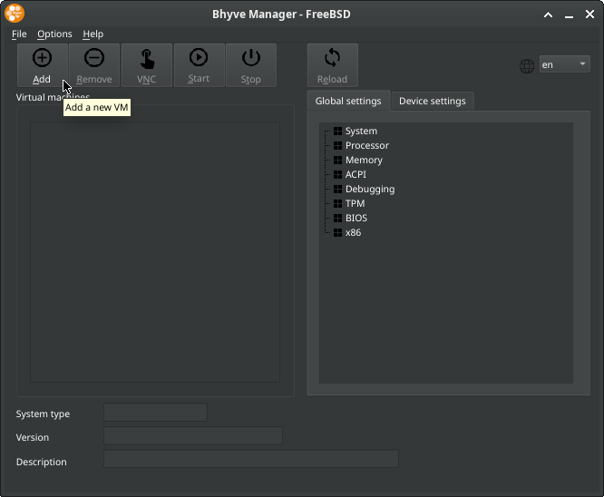
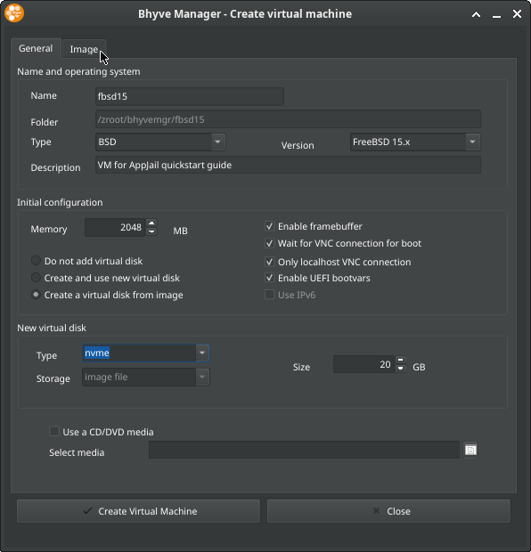
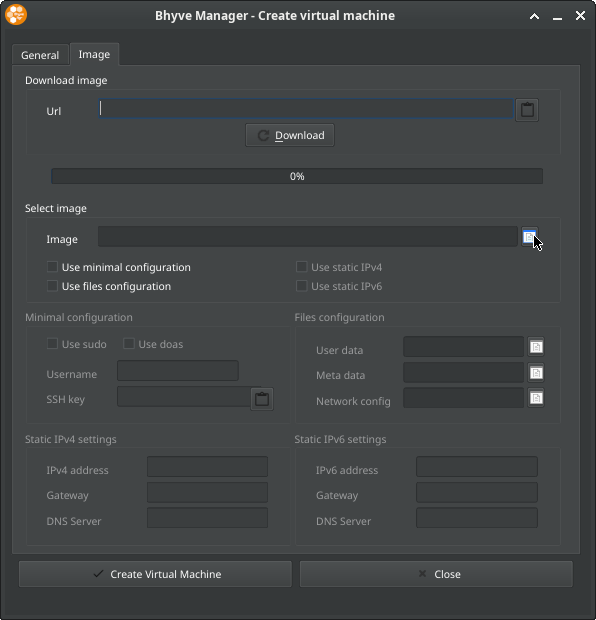
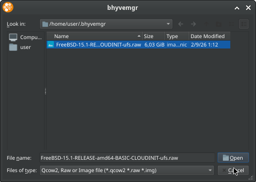
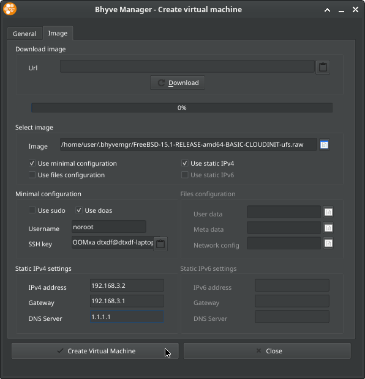
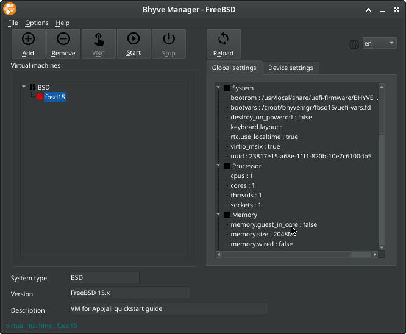
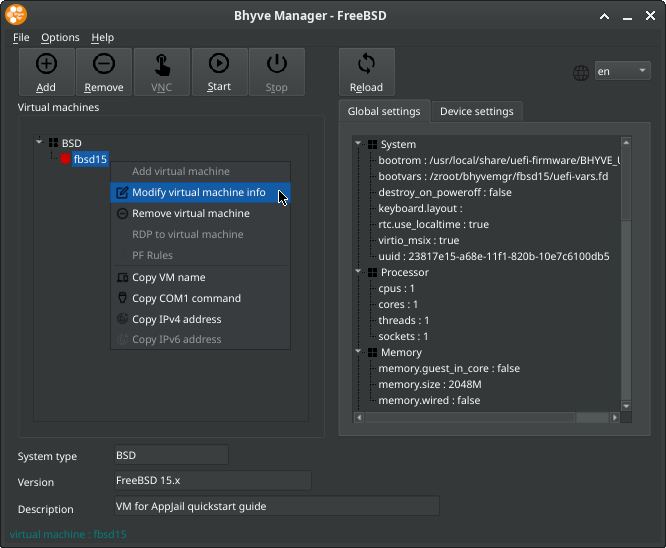
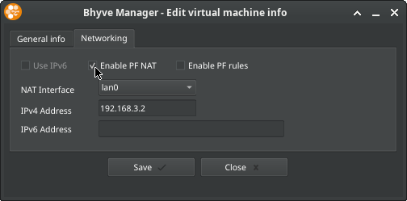
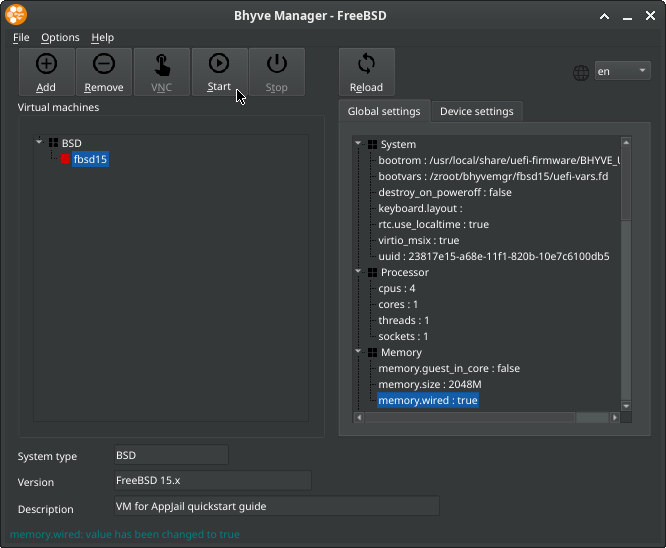
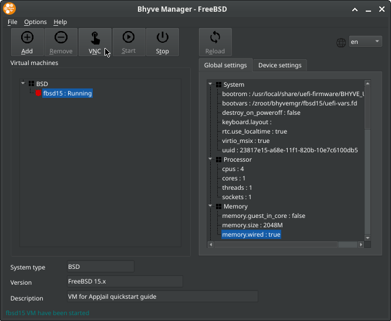

**AppJail** offers numerous features and commands for both simple use cases and complex tasks. This guide is designed to help you setup your host and familiarize yourself with the most common tasks.

## Host Setup

!!! tip

    This section explains how to use a script to easily initialize your host. Read `appjail-tutorial(7)` if you prefer to initialize your host by hand.

!!! warning

    If you have an `appjail.conf(5)` file, this script will create a backup only once, but it will always overwrite your `appjail.conf(5)` file.

AppJail works out of the box even if you haven't created an `appjail.conf(5)` configuration file, but some features are only enabled after installing certain optional dependencies, and it is recommended that you create a configuration file for performance and reliability reasons. For example, the `EXT_IF` parameter is used to define the external interface, and if you don't set it, AppJail will have to guess it every time you run a subcommand. While this may not cause you any problems, it's preferable to set a static value so you know to what extent your environment has changed and to avoid surprises.

However, there is a script called [`AppJail.setup`](https://github.com/DtxdF/AppJail.setup) that configures your host easily with a single command.

```console
$ fetch https://raw.githubusercontent.com/DtxdF/AppJail.setup/refs/heads/main/AppJail.setup
$ chmod +x AppJail.setup
$ ./AppJail.setup --help
```

With `--help`, you can see the available options for initializing your host. However, in almost all cases, you'll only need one or two: `--enable-common` (**UFS**) or `--enable-common --enable-zfs` (**ZFS**).

```console
$ # ZFS
$ ./AppJail.setup --enable-common --enable-zfs --overwrite-resolv-conf
$ # UFS
$ ./AppJail.setup --enable-common --overwrite-resolv-conf
```

You probably already have a `resolv.conf(5)` file on your system, and `AppJail.setup` will not overwrite it unless you set the `--overwrite-resolv-conf` parameter. Since `--enable-common` enables [DNS in AppJail](https://appjail.readthedocs.io/en/latest/networking/DNS/), it might be a good idea to overwrite it so that it points to the new nameserver.

The command above will also create a default virtual network with the address `10.0.0.0/10` and an interface used for DNS with the address `172.16.0.1/32`. If this causes a problem with your current host (for example, if an address conflict occurs), you should set the following parameters before running the `AppJail.setup` script:

```console
$ # ZFS
$ ./AppJail.setup \
    --enable-common \
    --enable-zfs \
    --overwrite-resolv-conf \
    --virtualnet-addr 192.168.4.0/24 \
    --dns-addr 172.16.0.2
$ # UFS
$ ./AppJail.setup \
    --enable-common \
    --overwrite-resolv-conf \
    --virtualnet-addr 192.168.4.0/24 \
    --dns-addr 172.16.0.2
```

If you prefer to use the development version of AppJail and its friends, add the `--bleeding-edge` parameter.

```console
$ # ZFS
$ ./AppJail.setup \
    --enable-common \
    --enable-zfs \
    --overwrite-resolv-conf \
    --virtualnet-addr 192.168.4.0/24 \
    --dns-addr 172.16.0.2 \
    --bleeding-edge
$ # UFS
$ ./AppJail.setup \
    --enable-common \
    --overwrite-resolv-conf \
    --virtualnet-addr 192.168.4.0/24 \
    --dns-addr 172.16.0.2 \
    --bleeding-edge
```

!!! info

    A more minimal `pf.conf(5)` could be installed if you set `--use-pf-minimal` to add only the minimum anchors required for virtual networks, but keep in mind that this will not restrict communication between external hosts and your host, and that your jails will be able to communicate without restrictions.

**What does the `--enable-common` parameter configure?**:

* Enable [DNS in AppJail](https://appjail.readthedocs.io/en/latest/networking/DNS/) so you can resolve the jail's IPv4 address behind a virtual network using its name as the hostname.
* Install [Director](https://github.com/DtxdF/director) for multi-jail deployments.
* Enable [healthcheckers](https://appjail.readthedocs.io/en/latest/healthcheckers/).
* Create a default virtual network, enable IPv4 forwarding, configure your `loader.conf(5)` to load the `if_bridge(4)` and `bridgestp` modules, so that bridge filtering (`net.link.bridge.pfil_member=1` and `net.link.bridge.pfil_bridge=1` in `sysctl.conf(5)`) takes effect, enable and start `pflog(4)`, configure your `pf.conf(5)` with a configuration that is secure by default and designed for [Security Group](https://github.com/DtxdF/AppJail/wiki/filter) hooks, and finally, enable and start `pf(4)`.
* Create a loopback interface commonly used by LinuxJails.
* Configure and mount `tmpfs(5)` to use it as [AppJail's temporary directory](https://github.com/DtxdF/AppJail/wiki/tmpdir). Note that this does not affect your host directory, since AppJail uses its own directory for this purpose.
* Enable the RAACT framework for [resource limits](https://appjail.readthedocs.io/en/latest/limits/).
* Configure your host for [trusted users](https://appjail.readthedocs.io/en/latest/trusted-users/).
* Enable the hook system in AppJail.
* Install `git` for [Makejails](https://appjail.readthedocs.io/en/latest/makejails/intro/). It isn't strictly necessary, but it's often used with them.
* Install `debootstrap` for [LinuxJails](https://appjail.readthedocs.io/en/latest/linux/).
* Install dependencies required by [OCI](https://appjail.readthedocs.io/en/latest/OCI/).
* Install `rage-encryption`, which is required for [AppJail Secrets](https://appjail.readthedocs.io/en/latest/secrets/).
* Bootstrap a release.

**What you still need to do manually**:

1. If executing `sysctl kern.racct.enable` is `0` even after the previous script has completed successfully, you must reboot the system to enable the RAACT framework.
2. You must manually add your user to the `appjail` group and log in again for the changes to take effect. This is only necessary if you want to use AppJail as a user without root privileges, but please refer to the relevant documentation for more details and information about the implications.
3. Pay attention to the output, as the script might show you something interesting.

## The Powerful `quick` Command, Virtual Networks and Common Tasks

AppJail includes numerous commands, but there is one that serves as the engine for other commands such as `appjail-oci(1)`, `appjail-image(1)`, or even `appjail-makejail(1)`, and it is called `appjail-quick(1)`. With `appjail-quick(1)`, you create a jail by specifying `appjail-quick(1)`'s options, and the jail is customized based on those options.

Let's begin by bootstrapping a release...

### Bootstrapping a release

!!! tip

    If you've used `AppJail.setup`, a release (also known as the "base directory") has already been bootstrapped.

The process of creating a traditional jail in AppJail begins with bootstrapping a release. This is also known as the base directory. The reason is that a directory is created containing all the files needed to create a jail, but instead of using that directory as the jail directory, AppJail copies it to a new directory, and that new directory becomes the jail directory. This way, each new jail created has its own private directory that will not affect other jails.

The command responsible for creating releases is `appjail-fetch(1)`. It offers numerous subcommands for creating releases in different ways and, in some cases, for different types of jails. Let's start by creating a release for FreeBSD-based jails.

```console
$ appjail fetch www -v 15.1-RELEASE
```

!!! note

    Always check https://freebsd.org for supported versions. The versions specified in this document are for demonstration purposes only.

In FreeBSD, this method is called *distribution sets*, and you should use it if your version of FreeBSD is 14.x or earlier. For newer systems, always use [pkgbase(8)](https://appjail.readthedocs.io/en/latest/pkgbase/).

```console
$ appjail fetch pkgbase -v 15
```

Once a release has bootstrapped successfully, you can see a list of all releases using the `list` subcommand.

```console
$ appjail fetch list
ARCH   VERSION       NAME
amd64  15.1-RELEASE  default
amd64  15            default
```

### Create a Jail

AppJail can create traditional jails once a release has been bootstrapped, and the recommended command for this task is `appjail-quick(1)`.

```console
$ appjail quick myjail start
```

It's pretty simple, but the jail has a lot of restrictions since we haven't specified any network options. Let's fix that!

```console
$ appjail quick myjail start alias ip4_inherit ip6_inherit overwrite=force
```

There are many more parameters, but it's pretty easy to understand:

1. `alias ip4_inherit ip6_inherit`: Inherits the host's network stack.
2. `overwrite=force`: By default, `appjail-quick(1)` does not create a jail if one with the same name as the one we specified already exists. The `overwrite=force` option destroys the jail if it already exists. This works very well for our purposes.

### Listing jails

```console
$ appjail jail list
STATUS  NAME    TYPE  VERSION  PORTS  NETWORK_IP4
UP      myjail  thin  15       -      -
```

### Start, Stop, Restart a Jail

**Stop**:

```console
$ appjail stop myjail
```

**Start**:

```console
$ appjail start myjail
```

**Restart**:

```console
$ appjail restart myjail
```

### Installing packages

```console
$ appjail pkg jail myjail install -y htop
```

### Safely edit system rc files within a jail

```console
$ appjail sysrc jail myjail sshd_enable=YES
sshd_enable: NO -> YES
```

### Control (start/stop/etc.) or list system services within a jail

```console
$ appjail service jail myjail sshd start
Generating RSA host key.
3072 SHA256:hK1B/BwUx6+JUk11DF2Ioh2Lpmnr33hPsfzjk8XE3mM root@myjail.appjail (RSA)
Generating ECDSA host key.
256 SHA256:VNkteMwixoDCpY+ElLwJ5h31h4olm/NMDGM2Tx83QDY root@myjail.appjail (ECDSA)
Generating ED25519 host key.
256 SHA256:iy7HH/7sWJxXIrALwCLZMu4UIlanNGXTjv8wbISDvM4 root@myjail.appjail (ED25519)
Performing sanity check on sshd configuration.
Starting sshd.
```

### Execute commands in a jail

```console
$ appjail cmd jexec myjail ps aux
USER   PID %CPU %MEM   VSZ  RSS TT  STAT STARTED    TIME COMMAND
root 44757  0,0  0,0 14292 2460  -  IsJ  01:14   0:00,00 /usr/sbin/cron -s
root 82786  0,0  0,0 14432 2848  -  SCsJ 01:14   0:00,00 /usr/sbin/syslogd -s
root 84236  0,0  0,0 14432 2672  -  IJ   01:14   0:00,00 syslogd: syslogd.casper (syslogd)
root 84672  0,0  0,0 14432 2644  -  IsJ  01:14   0:00,00 syslogd: system.net (syslogd)
root 93209  0,0  0,0 14920 2952  4  R+J  01:16   0:00,00 ps aux
```

For interactive processes (e.g., Python, htop, top, etc.), you should set the `-i` parameter.

```console
$ appjail cmd jexec myjail -i htop
```

### Log into the jail

```console
$ appjail login myjail
```

When you're done, press `CTRL-D` or simply type `exit` to return to the host.

### Rename a Jail

```console
$ appjail stop myjail
...
$ appjail jail rename myjail jtest
$ appjail jail list -j jtest
STATUS  NAME   TYPE  VERSION  PORTS  NETWORK_IP4
DOWN    jtest  thin  15       -      -
$ appjail start jtest
...
$ appjail jail list -j jtest
STATUS  NAME   TYPE  VERSION  PORTS  NETWORK_IP4
UP      jtest  thin  15       -      -
```

### `ping(8)` and `ping: ssend socket: Operation not permitted`

If you try to `ping(8)` a host from a jail that uses that host's network stack, you'll encounter the following error:

```console
$ appjail cmd jexec jtest ping -c4 1.1.1.1
ping: ssend socket: Operation not permitted
```

Although this network mode is very permissive, a jail has this restriction by default. However, if you really need to use raw sockets, in AppJail the `jail(8)` parameters can be passed through an `appjail-template(5)`. By default, AppJail uses the following template:

**/usr/local/share/appjail/files/default_template.conf**:

```console
exec.start: "/bin/sh /etc/rc"
exec.stop: "/bin/sh /etc/rc.shutdown jail"
mount.devfs
persist
```

Let's make a new copy to add the `allow.raw_sockets` parameter.

```console
$ cp /usr/local/share/appjail/files/default_template.conf template.conf
$ chmod +w template.conf
$ $EDITOR template.conf
$ cat template.conf
exec.start: "/bin/sh /etc/rc"
exec.stop: "/bin/sh /etc/rc.shutdown jail"
mount.devfs
persist
allow.raw_sockets
```

And then, all you have to do is add the `template` parameter to your `appjail-quick(1)` command:

```console
$ appjail quick jtest start alias ip4_inherit ip6_inherit overwrite=force template=template.conf
```

And `ping(8)` will work as expected!

```console
$ appjail cmd jexec jtest ping -c4 1.1.1.1
PING 1.1.1.1 (1.1.1.1): 56 data bytes
64 bytes from 1.1.1.1: icmp_seq=0 ttl=52 time=38.113 ms
64 bytes from 1.1.1.1: icmp_seq=1 ttl=52 time=36.769 ms
64 bytes from 1.1.1.1: icmp_seq=2 ttl=52 time=37.378 ms
64 bytes from 1.1.1.1: icmp_seq=3 ttl=52 time=37.852 ms

--- 1.1.1.1 ping statistics ---
4 packets transmitted, 4 packets received, 0.0% packet loss
round-trip min/avg/max/stddev = 36.769/37.528/38.113/0.511 ms
```

### Destroy a Jail

```console
$ appjail stop jtest
...
$ appjail jail destroy -f jtest
```

### Virtual Networks

One of AppJail's most useful features is [virtual networks](https://appjail.readthedocs.io/en/latest/networking/virtual-networks/intro/). A virtual network allows you to associate a jail with its own private network, so that it gets its own IPv4 address.

```console
$ appjail quick myjail start virtualnet=":<random> default" nat overwrite=force
```

We have replaced `alias ip4_inherit ip6_inherit` with `virtualnet=":<random> default" nat`. Let's break down each option:

1. `virtualnet`
    1. `:<random>`: Use the default virtual network created by AppJail (usually `ajnet`) or create one if it doesn't exist. You can explicitly set a virtual network by specifying it as follows: `ajnet:<random> default`. However, when you explicitly set a virtual network, AppJail will not create it for you.
        
        After the colon, the word `<random>` appears. This tells AppJail to use a random name as the name of the jail interface. We can explicitly set it to an arbitrary name, but in most cases this doesn't matter. The interface name becomes important when using something like `pf(4)` inside the jail and you want a more predictable interface name.

        Another special keyword is `<name>`, which uses the jail name as the name of the jail interface, but keep in mind that there may be characters allowed in the jail name that are not allowed in the name of the jail interface. AppJail will display an error message in such cases.

    2. `default`: This tells AppJail to use this network as the default router. Additionally, in this case, it tells `appjail-quick(1)` to use this network for options that require it, such as `nat` or `expose`, so it is not necessary to explicitly set it in those options.

2. `nat`: By using the options shown above, we are essentially allowing the jail to communicate with the outside world through the external interface configured with `AppJail.setup`. This option creates a `pf(4)` rule to translate the jail's IPv4 address, assigned by the virtual network, to the IP address of the external interface. In most cases, this essentially means "allow Internet access in this jail."

Once virtual network is created, you can list of all of them using the following command:

```console
$ appjail network list
NAME   NETWORK   CIDR  BROADCAST      GATEWAY   MINADDR   MAXADDR        ADDRESSES  DESCRIPTION      MTU
ajnet  10.0.0.0  10    10.63.255.255  10.0.0.1  10.0.0.1  10.63.255.254  4194302    AppJail network  1500
```

A jail that uses this network mode has its own network stack, and the restriction mentioned above regarding raw sockets no longer applies; therefore, it is not necessary to set the `allow.raw_sockets` parameter.

```console
$ appjail cmd jexec myjail ping -c4 1.1.1.1
PING 1.1.1.1 (1.1.1.1): 56 data bytes
64 bytes from 1.1.1.1: icmp_seq=0 ttl=51 time=38.009 ms
64 bytes from 1.1.1.1: icmp_seq=1 ttl=51 time=37.302 ms
64 bytes from 1.1.1.1: icmp_seq=2 ttl=51 time=39.376 ms
64 bytes from 1.1.1.1: icmp_seq=3 ttl=51 time=37.747 ms

--- 1.1.1.1 ping statistics ---
4 packets transmitted, 4 packets received, 0.0% packet loss
round-trip min/avg/max/stddev = 37.302/38.108/39.376/0.775 ms
```

If you have used `AppJail.setup` and did not use `--use-pf-minimal`, your `pf.conf(5)` file will be configured with restrictions: by default, jails cannot communicate with private IPv4 addresses unless you explicitly allow it. This also means that, since the DNS server installed and configured on your host uses a private IPv4 address, the jails cannot resolve hostnames. 

```console
$ appjail cmd jexec myjail host example.org
;; connection timed out; no servers could be reached
```

In order for the jails to communicate with the DNS server installed and configured on your server, you must add an `appjail-label(1)` used by the security group hooks. In the `pf.conf(5)` file installed by the `AppJail.setup` script, a very useful `pf(4)` table called `allow-dns` is created, which allows you to add IPv4 addresses without having to define a rule each time.

```console
$ appjail quick myjail \
    start \
    virtualnet=":<random> default" \
    nat \
    overwrite=force \
    label="security-group:1" \
    label="security-group.tables.allow-dns:allow-dns"
$ appjail cmd jexec myjail host example.org
example.org has address 104.20.26.136
example.org has address 172.66.157.237
example.org mail is handled by 0 .
$ appjail cmd jexec myjail host -v example.org | grep '172\.16\.0\.1'
Received 61 bytes from 172.16.0.1#53 in 0 ms
Received 29 bytes from 172.16.0.1#53 in 0 ms
Received 44 bytes from 172.16.0.1#53 in 37 ms
$ appjail cmd jexec myjail cat /etc/resolv.conf
nameserver 172.16.0.1
```

Since jails use a private IPv4 address, they cannot communicate freely with each other unless a rule is added to allow it.

**Jail #1 / Server**:

```console
$ appjail quick jserver \
    start \
    virtualnet=":<random> default" \
    nat \
    overwrite=force \
    label="security-group:1" \
    label="security-group.tables.allow-dns:allow-dns"
$ appjail cmd jexec jserver nc -vl 8080
Connection from jclient 47013 received!
Welcome!

```

**Jail #2 / Client**

```console
$ appjail quick jclient \
    start \
    virtualnet=":<random> default" \
    nat \
    overwrite=force \
    label="security-group:1" \
    label="security-group.tables.allow-dns:allow-dns" \
    label="security-group.rules.allow-jserver:pass on appjail_epair proto tcp from %i to jserver port 8080"
$ appjail cmd jexec jclient nc -v jserver 8080
Connection to jserver 8080 port [tcp/http-alt] succeeded!
Welcome!

```

### Exposing ports

In the previous example, we created two jails. The first is the server that exposes a service, and the second is the client. Unlike this approach, it is also possible to connect to a service behind a jail from the host without any restrictions.

**Jail / Server**:

```console
$ appjail quick jserver \
    start \
    virtualnet=":<random> default" \
    nat \
    overwrite=force \
    label="security-group:1" \
    label="security-group.tables.allow-dns:allow-dns"
$ appjail cmd jexec jserver nc -vl 8080
Connection from ajnet.appjail 40573 received!
Hi, I'm the host!

```

**Host**:

```console
$ nc -v jserver 8080
Connection to jserver 8080 port [tcp/http-alt] succeeded!
Hi, I'm the host!

```

**External hosts**:

For external hosts, we must explicitly set the `expose` option. External hosts connect to the service using the host's IP address.

```console
$ appjail quick jserver \
    start \
    virtualnet=":<random> default" \
    nat \
    expose=8080 \
    overwrite=force \
    label="security-group:1" \
    label="security-group.tables.allow-dns:allow-dns"
$ appjail cmd jexec jserver nc -vl 8080
Connection from 192.168.0.105 46543 received!
Hi, I'm an external host!

```

In the previous example, we exposed the service on port `8080`, but the `expose` option also allows you to specify an arbitrary external port in case there is already a service on the host listening on the same `IP:PORT` combination.

```console
$ appjail quick jserver \
    start \
    virtualnet=":<random> default" \
    nat \
    expose=9090:8080 \
    overwrite=force \
    label="security-group:1" \
    label="security-group.tables.allow-dns:allow-dns"
```

### Automation (Advanced)

!!! note

    Please note that [Makejails](https://appjail.readthedocs.io/en/latest/makejails/intro/) and [InitScripts](https://appjail.readthedocs.io/en/latest/initscripts/) have their own sections and man pages. This document only explains the basics for illustrative purposes.

#### Your custom script and `appjail-quick(1)`

There's nothing stopping you from limiting the use of AppJail to bootstrapping the release and the creation of the jail, and then customizing it once it's been created.

**jssh.sh**:

```sh
#!/bin/sh

set -e -o pipefail

JAIL="${1:-jssh}"
SSH_PASSWORD=$(openssl rand -base64 16)

echo "> Creating jail" >&2

appjail quick "${JAIL}" \
    start \
    virtualnet=":<random> default" \
    nat \
    expose=2222:22 \
    overwrite=force \
    label="security-group:1" \
    label="security-group.tables.allow-dns:allow-dns"

echo "> Installing packages" >&2
appjail pkg jail "${JAIL}" install -y htop doas

echo "> Configuring doas.conf(5)" >&2

DOAS_CONF=$(mktemp)

cat << EOF > "${DOAS_CONF}"
permit noroot
EOF

appjail cmd local "${JAIL}" cp "${DOAS_CONF}" usr/local/etc/doas.conf

rm -f "${DOAS_CONF}"

echo "> Creating user 'noroot' with password '${SSH_PASSWORD}'" >&2
echo "${SSH_PASSWORD}" | appjail cmd jexec "${JAIL}" pw useradd -m -h 0 -n noroot

echo "> Starting SSH" >&2
appjail sysrc jail "${JAIL}" sshd_enable=YES
appjail service jail "${JAIL}" sshd start

echo "> Done." >&2
```

More traditional users might prefer this method, but let's look at some more interesting ways to accomplish the same task...

#### Makejail

A [Makejail](https://appjail.readthedocs.io/en/latest/makejails/intro/) is a simple text file in which instructions are defined line by line in uppercase. Let's rewrite the previous example using a `Makejail`.

**Makejail**:

```
OPTION start
OPTION virtualnet=:<random> default
OPTION nat
OPTION expose=2222:22
OPTION overwrite=force
OPTION label=security-group:1
OPTION label=security-group.tables.allow-dns:allow-dns

PKG htop doas

CMD echo "permit noroot" > /usr/local/etc/doas.conf

CMD SSH_PASSWORD=$(openssl rand -base64 16); \
    echo "> Creating user 'noroot' with password '${SSH_PASSWORD}'" >&2; \
    echo "${SSH_PASSWORD}" | pw useradd -m -h 0 -n noroot -d /noroot

SYSRC sshd_enable=YES
SERVICE sshd start
```

It's simple, isn't it? To create a jail with a `Makejail`, you must use `appjail-makejail(1)`.

```console
$ appjail makejail -j jssh
```

!!! tip

    See also `appjail-makejail(1)` and `appjail-makejail(5)`.

#### InitScript

An [InitScript](https://appjail.readthedocs.io/en/latest/initscripts/) is a POSIX shell, just like the one we created earlier, but the way it is written and used is a little different in AppJail. In fact, a `Makejail` is only responsible for creating the jail, but it will also generate an InitScript afterward. An InitScript contains certain functions that AppJail processes at different stages.

If you're interested in the details, check out the relevant section where they're discussed, as they're a bit more advanced.

Traditional users may also find this interesting.

!!! tip

    See also `appjail-initscript(5)`.

## The Ephemeral Concept (advanced)

In the previous examples, we have destroyed our jail over and over again. All the data we created inside the jail has also been destroyed. AppJail is a pioneer of **The Ephemeral Concept**, which recommends *separating data that should persist from data considered ephemeral*.

Traditional FreeBSD users may find this unsettling, as they treat their jails as if they were pets: installing packages, editing files here and there, or, more specifically, treating them as if they were other hosts. The problem with this approach is that users don't keep track of exactly how many changes they've made over time, and when performing tedious tasks like upgrading a jail, this leads to errors due to the entropy added. AppJail offers a better alternative to the traditional approach.

The first step in implementing this concept is to consider which data should be preserved even if we destroy our jail. In the case of the `jssh` jail we created earlier, these should be `/etc/ssh` and `/noroot`. The first directory is where SSH files, such as keys, are stored, and the second is the user's home directory. The second step is to consider the owner, group, and file mode of the files and directories containing the data that should persist. Services like SSH require specific permissions, and in the case of our home directory, these must match the same UID and GID as the file we created inside the jail. Let's rewrite our Makejail based on this analysis.

**Makejail**:

```
OPTION start
OPTION virtualnet=:<random> default
OPTION nat
OPTION expose=2222:22
OPTION overwrite=force
OPTION label=security-group:1
OPTION label=security-group.tables.allow-dns:allow-dns

PKG htop doas

CMD echo "permit noroot" > /usr/local/etc/doas.conf

CMD SSH_PASSWORD=$(openssl rand -base64 16); \
    echo "> Creating user 'noroot' with password '${SSH_PASSWORD}'" >&2; \
    echo "${SSH_PASSWORD}" | pw useradd -m -h 0 -n noroot -d /noroot; \
    chown noroot:noroot /noroot; \
    chmod 755 /noroot

CMD chown root:wheel /etc
CMD chmod 755 /etc
CMD chown root:wheel /etc/ssh
CMD chmod 755 /etc/ssh
CMD chown root:wheel /etc/ssh/sshd_config
CMD chmod 655 /etc/ssh/sshd_config
CMD if [ -f /etc/ssh/authorized_keys ]; then chown root:wheel /etc/ssh/authorized_keys; fi
CMD if [ -f /etc/ssh/authorized_keys ]; then chmod 655 /etc/ssh/authorized_keys; fi

SYSRC sshd_enable=YES
SERVICE sshd start
```

Let's create our jail again.

```console
$ appjail makejail -j jssh
```

If everything goes well, we can move on to the next step.

```console
$ DATADIR="${PWD}/.volumes/jssh"
$ SSHDIR="${DATADIR}/ssh"
$ USERDIR="${DATADIR}/user"
$ mkdir -p "${SSHDIR}" "${USERDIR}"
$ appjail makejail -j jssh -o fstab="${SSHDIR} /etc/ssh <pseudofs>" \
    -o fstab="${USERDIR} /noroot"
```

In the previous example, we created two directories: `.volumes/jssh/ssh` and `.volumes/jssh/user`. They can have any name. And, as we mentioned earlier, `appjail-quick(1)` is the engine behind many other AppJail commands. That's why we can reuse options in a `Makejail` using `OPTION` or, in the previous case, using the `-o` parameter for `appjail-makejail(1)`. We could move `-o fstab` into the `Makejail`, but for this example, let's keep it simple.

*So this is "The Ephemeral Concept"?* Yes! That's it, and as you can see, it's very simple. *And how do I know it works?* Log in to your jail using `ssh(1)` with the password that the `Makejail` will show you, and create a file in `/noroot` (once you've logged in, you should be here) named `readme.txt`.

```console
$ ssh noroot@jssh
The authenticity of host 'jssh (10.0.0.7)' can't be established.
ED25519 key fingerprint is SHA256:CR47/T54HoLYAWyMbfhftPIgNeQ2xu/dlhFAWS/sA2A.
This key is not known by any other names.
Are you sure you want to continue connecting (yes/no/[fingerprint])? yes
Warning: Permanently added 'jssh' (ED25519) to the list of known hosts.
(noroot@jssh) Password for noroot@jssh.appjail:
FreeBSD 15.1-STABLE (GENERIC) #2 stable/15-n285178-8a4fcb694526-dirty: Thu Aug 27 21:57:41 -04 2026

Welcome to FreeBSD!

Release Notes, Errata: https://www.FreeBSD.org/releases/
Security Advisories:   https://www.FreeBSD.org/security/
FreeBSD Handbook:      https://www.FreeBSD.org/handbook/
FreeBSD FAQ:           https://www.FreeBSD.org/faq/
Questions List:        https://www.FreeBSD.org/lists/questions/
FreeBSD Forums:        https://forums.FreeBSD.org/

Documents installed with the system are in the /usr/local/share/doc/freebsd/
directory, or can be installed later with:  pkg install en-freebsd-doc
For other languages, replace "en" with a language code like de or fr.

Show the version of FreeBSD installed:  freebsd-version ; uname -a
Please include that output and any error messages when posting questions.
Introduction to manual pages:  man man
FreeBSD directory layout:      man hier

To change this login announcement, see motd(5).
To display the compression ratio for the ZFS dataset /var/log on the pool
mypool, run the following command:

zfs get refcompressratio mypool/var/log

The refcompressratio will only display the compression ratio for that specific
dataset, not the descendant datasets. To include the child datasets, the
command looks like this:

zfs get compressratio mypool/var

		-- Benedict Reuschling <bcr@FreeBSD.org>
noroot@jssh:~ $ echo "Hello, world!" > readme.txt
noroot@jssh:~ $ ^D
Shared connection to jssh closed.
```

Let's recreate our jail using the same command-line arguments and then log in again.

```console
$ appjail makejail -j jssh -o fstab="${SSHDIR} /etc/ssh <pseudofs>" \
    -o fstab="${USERDIR} /noroot"
...
$ ssh noroot@jssh
(noroot@jssh) Password for noroot@jssh.appjail:
FreeBSD 15.1-STABLE (GENERIC) #2 stable/15-n285178-8a4fcb694526-dirty: Thu Aug 27 21:57:41 -04 2026

Welcome to FreeBSD!

Release Notes, Errata: https://www.FreeBSD.org/releases/
Security Advisories:   https://www.FreeBSD.org/security/
FreeBSD Handbook:      https://www.FreeBSD.org/handbook/
FreeBSD FAQ:           https://www.FreeBSD.org/faq/
Questions List:        https://www.FreeBSD.org/lists/questions/
FreeBSD Forums:        https://forums.FreeBSD.org/

Documents installed with the system are in the /usr/local/share/doc/freebsd/
directory, or can be installed later with:  pkg install en-freebsd-doc
For other languages, replace "en" with a language code like de or fr.

Show the version of FreeBSD installed:  freebsd-version ; uname -a
Please include that output and any error messages when posting questions.
Introduction to manual pages:  man man
FreeBSD directory layout:      man hier

To change this login announcement, see motd(5).
Need to see the calendar for this month? Simply type "cal".  To see the
whole year, type "cal -y".
		-- Dru <genesis@istar.ca>
noroot@jssh:~ $ cat readme.txt
Hello, world!
noroot@jssh:~ $ ^D
Shared connection to jssh closed.
```

Our file was preserved even if we recreated our jail, and the SSH client trusted the SSH server behind in the jail because the keys were the same. Note that what changes with each run of our `Makejail` is the `noroot` password. This is not a bug, it's a feature.

**Upgrades and "The Ephemeral Concept"**:

Where "The Ephemeral Concept" becomes most important is when saving time by merging files between upgrades. With the "Ephemeral Concept" approach, we can simply update our release rather than performing a full upgrade. If we want to "upgrade" a jail from a FreeBSD release to a major version, we just need to recreate our jail, telling AppJail to use that major version. We can even do something crazy as downgrading our jail:

```console
$ appjail fetch www -v 14.4-RELEASE
...
$ env PAGER=cat appjail update release -v 14.4-RELEASE
...
$ appjail jail list -j jssh
STATUS  NAME  ALT_NAME  TYPE  VERSION  PORTS           NETWORK_IP4
UP      jssh  -         thin  15       2222 -> 22/tcp  10.0.0.7
$ appjail makejail -j jssh -o fstab="${SSHDIR} /etc/ssh <pseudofs>" \
    -o fstab="${USERDIR} /noroot" -o osversion=14.4-RELEASE
...
$ appjail jail list -j jssh
STATUS  NAME  ALT_NAME  TYPE  VERSION       PORTS           NETWORK_IP4
UP      jssh  -         thin  14.4-RELEASE  2222 -> 22/tcp  10.0.0.7
```

You don't upgrade in the traditional sense using `appjail-upgrade(1)`; instead, you simply need to recreate the jail specifying an arbitrary FreeBSD version. That's all.

!!! tip

    See also `appjail-ephemeral(7)`.

## A fresh environment via bhyvemgr

A virtual machine is the best place to experiment. `AppJail.setup` could be executed in a virtual machine and then you can copy the configuration files it generates back to the host, allowing you to merge them in a predictably manner.

The most user-friendly bhyve manager is [bhyvemgr](https://github.com/alonsobsd/bhyvemgr). Let's deploy a FreeBSD VM using it.

1. Open bhyvemgr, and then tap Add.

    

2. Fill in all the fields, and then let's move on to the `image` section, since we're going to use a cloud-init image.

    

3. If you haven't downloaded the image yet, enter the URL in the first field. bhyvemgr will download it for you. In my case, since I already have the image downloaded, I just need to select it.

    

    

4. Next, fill in the rest of the fields.

    

5. Done. But let's modify the virtual machine's settings to instruct bhyvemgr to add a NAT rule for this virtual machine to allow it to connect to the outside world.

    

    

    

6. Tweak any additional settings, and then tap Start.

    

7. The virtual machine is ready, but it will wait for you to tap VNC to boot the system.

    

The last step will open a VNC session. You can press CTRL+ALT+M to display the options to minimize the window or close the VNC session. Closing the VNC session does not mean that your virtual machine will shut down.

The way we've configured our virtual machine allows us to connect to it via SSH:

```console
$ ssh noroot@192.168.3.2
The authenticity of host '192.168.3.2 (192.168.3.2)' can't be established.
ED25519 key fingerprint is SHA256:fTDkKg79uzCKD43RWoEfGrikdAs5Wts/Rh/lD0xUHrs.
This key is not known by any other names.
Are you sure you want to continue connecting (yes/no/[fingerprint])? yes
Warning: Permanently added '192.168.3.2' (ED25519) to the list of known hosts.
FreeBSD 15.1-RELEASE-p3 (GENERIC) releng/15.1-n283611-88e7371d9dc2

Welcome to FreeBSD!

Release Notes, Errata: https://www.FreeBSD.org/releases/
Security Advisories:   https://www.FreeBSD.org/security/
FreeBSD Handbook:      https://www.FreeBSD.org/handbook/
FreeBSD FAQ:           https://www.FreeBSD.org/faq/
Questions List:        https://www.FreeBSD.org/lists/questions/
FreeBSD Forums:        https://forums.FreeBSD.org/

Documents installed with the system are in the /usr/local/share/doc/freebsd/
directory, or can be installed later with:  pkg install en-freebsd-doc
For other languages, replace "en" with a language code like de or fr.

Show the version of FreeBSD installed:  freebsd-version ; uname -a
Please include that output and any error messages when posting questions.
Introduction to manual pages:  man man
FreeBSD directory layout:      man hier

To change this login announcement, see motd(5).
Want to see how much virtual memory you're using? Just type "swapinfo" to
be shown information about the usage of your swap partitions.
noroot@fbsd15:~ $
```

Let's initialize this virtual machine by running `AppJail.setup`. In an SSH session, you should use `nohup(1)`, because once `pf(4)` starts, your SSH session will be dropped, but the script may continue, ignoring the `SIGHUP` signal.

```console
noroot@fbsd15:~ $ fetch https://raw.githubusercontent.com/DtxdF/AppJail.setup/refs/heads/main/AppJail.setup
AppJail.setup                                           45 kB 1162 kBps    00s
noroot@fbsd15:~ $ chmod +x AppJail.setup
noroot@fbsd15:~ $ doas nohup ./AppJail.setup --enable-common --overwrite-resolv-conf --virtualnet-addr 192.168.4.0/24 --dns-addr 172.16.0.2 --bleeding-edge &
appending output to nohup.out
noroot@fbsd15:~ $ doas tail -f nohup.out
======> Bootstrapping AppJail
======> Creating /root/applications
===> + mkdir -p -- /root/applications
===> Installing git-tiny
===> + pkg install git-tiny
Updating FreeBSD-ports repository catalogue...
FreeBSD-ports repository is up to date.
Updating FreeBSD-ports-kmods repository catalogue...
FreeBSD-ports-kmods repository is up to date.
Updating FreeBSD-base repository catalogue...
...
```

You'll be able to see everything this script does in real time, although it might take a little while. Just keep in mind that you'll be disconnected after starting `pf(4)`:

```console
===> Starting
===> + service pf start
Enabling pf.
Shared connection to 192.168.3.2 closed.
```

Log in again.

```console
$ ssh noroot@192.168.3.2
Last login: Wed Sep  2 01:53:21 2026 from 192.168.3.1
FreeBSD 15.1-RELEASE-p3 (GENERIC) releng/15.1-n283611-88e7371d9dc2

Welcome to FreeBSD!

Release Notes, Errata: https://www.FreeBSD.org/releases/
Security Advisories:   https://www.FreeBSD.org/security/
FreeBSD Handbook:      https://www.FreeBSD.org/handbook/
FreeBSD FAQ:           https://www.FreeBSD.org/faq/
Questions List:        https://www.FreeBSD.org/lists/questions/
FreeBSD Forums:        https://forums.FreeBSD.org/

Documents installed with the system are in the /usr/local/share/doc/freebsd/
directory, or can be installed later with:  pkg install en-freebsd-doc
For other languages, replace "en" with a language code like de or fr.

Show the version of FreeBSD installed:  freebsd-version ; uname -a
Please include that output and any error messages when posting questions.
Introduction to manual pages:  man man
FreeBSD directory layout:      man hier

To change this login announcement, see motd(5).
To see the output from when your computer started, run dmesg(8).  If it has
been replaced with other messages, look at /var/run/dmesg.boot.
		-- Francisco Reyes <lists@natserv.com>
noroot@fbsd15:~ $ doas tail -f nohup.out
[133/189] Fetching FreeBSD-local-unbound-dev-15.snap20260812194519: .......... done
[134/189] Fetching FreeBSD-lp-15.snap20260816025331: .......... done
[135/189] Fetching FreeBSD-libcompiler_rt-dev-15.snap20260803003759: .......... done
[136/189] Fetching FreeBSD-kernel-man-15.snap20260830014226: .......... done
[137/189] Fetching FreeBSD-bluetooth-dev-15.snap20260807155644: ......... done
[138/189] Fetching FreeBSD-zstd-15.snap20260814160322: .......... done
[139/189] Fetching FreeBSD-libvmmapi-15.snap20260816025331: .. done
[140/189] Fetching FreeBSD-kerberos-15.snap20260814160322: .......... done
[141/189] Fetching FreeBSD-cron-15.snap20260814160322: ..... done
[142/189] Fetching FreeBSD-clang-15.snap20260816025331: .......... done
[143/189] Fetching FreeBSD-libdwarf-dev-15.snap20260720163328: ...
```

The script continues to run even after this event. Let's be patient until it finishes.

```console
...
======> Installing director
===> + git -C /root/applications clone https://github.com/DtxdF/director.git
Cloning into 'director'...
===> + env SUEXEC=command ./make.sh
pipx install  -e --force --global .
creating virtual environment...
creating shared libraries...
upgrading shared libraries...
WARNING: Skipping setuptools as it is not installed.
determining package name from '/root/applications/director'...
creating virtual environment...
installing director from spec '/root/applications/director'...
done! ✨ 🌟 ✨
  installed package director 0.18.0+c25f5ef3e4fd4503d2a0c45c7083a935654e18de, installed using Python 3.12.14
  These apps are now available
    - appjail-director
mkdir -m 755 -p "/opt/pipx/venvs/director/share/man/man1"
mkdir -m 755 -p "/opt/pipx/venvs/director/share/man/man5"
install -m 444 director.1 "/opt/pipx/venvs/director/share/man/man1/director.1"
install -m 444 director-spec.5 "/opt/pipx/venvs/director/share/man/man5/director-spec.5"
===> + mkdir -p /opt/pipx/venvs/director/etc
===> + rm -f /opt/pipx/venvs/director/etc/director.ini
======> Done.
^C
noroot@fbsd15:~ $ appjail version
5.4.0+76dfb760bb0db70b337a48af46f60f407b475676
noroot@fbsd15:~ $ appjail-director --version
appjail-director, version 0.18.0+c25f5ef3e4fd4503d2a0c45c7083a935654e18de
noroot@fbsd15:~ $
```

That's it!

---

!!! tip

    AppJail is able to work without a configuration file, but it is highly recommended
    to [configure it](configure.md) for performance and reliability reasons.

!!! tip

    AppJail has a very useful command if you want to get more information about a command
    and its parameters called `appjail-help(1)`.
