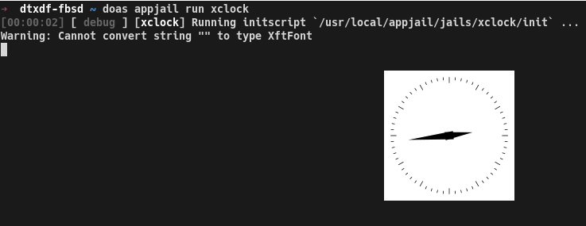

The process to run a GUI (x11) application in a jail is very easy using AppJail. You just need to mount the socket directory. AppJail has a shortcut for this in `appjail quick` named `x11`.

However, the process is a bit different if you want to run a GUI application on linux or FreeBSD.

On FreeBSD you must set `clear_tmp_X` to `NO` to not remove the sockets and various related files before the jail starts. At least in Debian, it is not necessary to something similar.

Another important thing is the user that will run the application. AppJail can run an application using a user other than `root`, but it is necessary to create one, do it in the stage build.

**Makejail**:
```
INCLUDE options/options.makejail
INCLUDE options/network.makejail
INCLUDE options/x11.makejail
INCLUDE xclock/Makejail

# See `Makejail and Initscripts`
STOP
```

**options/options.makejail**:
```
OPTION start
OPTION resolv_conf
OPTION tzdata
OPTION overwrite
```

**options/network.makejail**:
```
ARG interface
ARG ruleset

OPTION bridge=iface:${interface} xclock
OPTION dhcp=sb_xclock
OPTION mount_devfs
OPTION devfs_ruleset=${ruleset}
```

**options/x11.makejail**:
```
OPTION x11
OPTION copydir=files
OPTION file=/etc/rc.conf
```

**files/etc/rc.conf**:
```
clear_tmp_X="NO"
```

**xclock/Makejail**:
```
PKG xclock

CMD pw useradd -n xclock -c "Analog and digital clock for X" -d /home/xclock -s /bin/sh
CMD mkdir -p /home/xclock
CMD chown xclock:xclock /home/xclock

STAGE cmd

USER xclock
RUN xclock
```

The above problem can be solved by using the `files` or `file` and `copydir` options as you can see or by using the `COPY` or `SYSRC` commands. The first options are used because the files are copied before the jail is started with the `start` option.

To run the Makejail for xclock:

```sh
xhost +
appjail makejail -j xclock -- --interface jext --ruleset 10
appjail start xclock
appjail run xclock
# or
appjail run -V DISPLAY=:1 xclock
```



For details of how to run a GUI application in a jail, we recommend [JailGUIApplications](https://wiki.freebsd.org/JailingGUIApplications).

We recommend using `Xephyr`.
