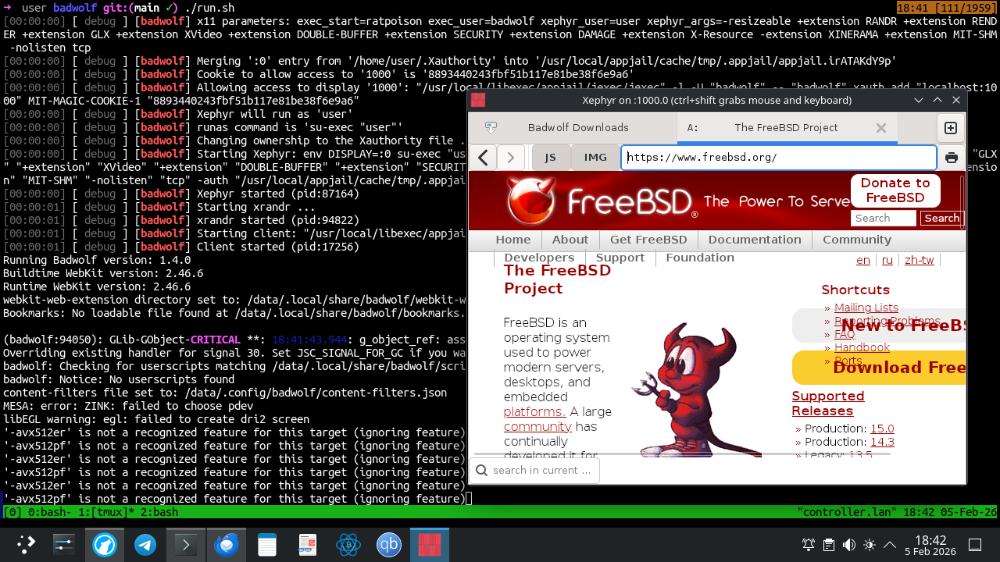

## Insecure / Testing-only

!!! warning

    See [Sandboxed x11 applications](#sandboxed-x11-applications) for a more effective and secure way to run x11 applications.

The process to run a GUI (x11) application in a jail is very easy using AppJail. You just need to mount the socket directory. AppJail has a shortcut for this in `appjail-quick(1)` named `x11`.

However, the process is a bit different if you want to run a GUI application on linux or FreeBSD.

On FreeBSD you must set `clear_tmp_X` to `NO` to not remove the sockets and various related files before the jail starts. At least in Debian, it is not necessary to do something similar.

Another important thing is the user that will run the application. AppJail can run an application using a user other than `root`, but it is necessary to create one, do it in the stage build.

**Makejail**:
```
INCLUDE options/options.makejail
INCLUDE options/network.makejail
INCLUDE options/x11.makejail
INCLUDE xclock/Makejail

# See `Makejail and Initscripts`
STOP
```

**options/options.makejail**:
```
OPTION start
OPTION resolv_conf
OPTION tzdata
OPTION overwrite
```

**options/network.makejail**:
```
ARG interface
ARG ruleset

OPTION bridge=iface:${interface} xclock
OPTION dhcp=sb_xclock
OPTION mount_devfs
OPTION devfs_ruleset=${ruleset}
```

**options/x11.makejail**:
```
OPTION x11
OPTION copydir=files
OPTION file=/etc/rc.conf
```

**files/etc/rc.conf**:
```
clear_tmp_X="NO"
```

**xclock/Makejail**:
```
PKG xclock

CMD pw useradd -n xclock -c "Analog and digital clock for X" -d /home/xclock -s /bin/sh
CMD mkdir -p /home/xclock
CMD chown xclock:xclock /home/xclock

STAGE cmd

USER xclock
RUN xclock
```

The above problem can be solved by using the `files` or `file` and `copydir` options as you can see or by using the `COPY` or `SYSRC` commands. The first options are used because the files are copied before the jail is started with the `start` option.

To run the Makejail for xclock:

```sh
xhost +
appjail makejail -j xclock -- --interface jext --ruleset 10
appjail start xclock
appjail run xclock
# or
appjail run -V DISPLAY=:1 xclock
```


For details of how to run a GUI application in a jail, we recommend [JailGUIApplications](https://wiki.freebsd.org/JailingGUIApplications).

## Sandboxed x11 applications

Although the `xhost +` trick is a common workaround for running an x11 application, it can become a nightmare for security reasons, since `/tmp/.X11-unix` is shared with each jail, which means that a compromised jail could communicate with the host's X server, thus escaping the isolated environment. Of course, you can use it for testing purposes only, but even then, AppJail implements a command called `appjail-x11(1)` to run an x11 application securely thanks to **MIT-MAGIC-COOKIE-1** authentication, so even though it shares `/tmp/.X11-unix`, applications inside the jail cannot communicate with other servers that are not authorized. Of course, how exactly is a jailed x11 application displayed on the screen? This is done thanks to `Xephyr(1)`, which creates another X server, and AppJail automates access to this server.

There are some examples you can find in [this repository](https://github.com/DtxdF/x11appjail), but let's create one to demonstrate how this command can be used.

**Makejail**:

```
# [1]
OPTION start
OPTION overwrite=force
OPTION volume=badwolf-data mountpoint:/data owner:25000 group:25000

# [2]
CMD pw useradd -n badwolf -d /data -u 25000 -s /bin/sh
CMD mkdir -p /data
CMD chown badwolf:badwolf /data

# [3]
CMD echo "exec badwolf" > /data/.ratpoisonrc
CMD chown badwolf:badwolf /data/.ratpoisonrc

# [4]
PKG badwolf dbus xauth xrandr ratpoison xorg-fonts mesa-dri mesa-libs

# [5]
SERVICE dbus enable
SERVICE dbus start
```

1. Here we are only creating the Makejail that defines what our jail will be. The common options are `start` and `overwrite=force` used by `appjail-quick(1)`, but we also specify a volume called `badwolf-data` so that if we want to download something, it will be kept even if we recreate the jail by calling the `create.sh` script again. You can also specify network options, but I recommend doing so outside of the Makejail, as this will allow you to customize them more easily and efficiently, as we do in `create.sh`.
2. To add another layer of security, we will run our x11 application as a user without privileges, so let's create a new user for this purpose.
3. You can run the x11 application without a window manager, but it may not work as expected. I recommend a window manager such as [ratpoison](https://freshports.org/x11-wm/ratpoison), as it is lightweight and displays the application in full screen mode by default, giving you an experience similar to running an application on the host. See [this article](https://wiki.archlinux.org/title/Ratpoison#Tips_and_tricks) for some tips and tricks.
4. You must install all dependencies required by the applications, but for `appjail-x11(1)` to work, you must install at least [x11/xauth](https://freshports.org/x11/xauth). [x11/xrandr](https://freshports.org/x11/xrandr) is only necessary to refresh the server, so when you resize `Xephyr(1)` using its `-resizeable` parameter, it works like an application running on your host, creating a better experience.
5. Not only do you have to worry about the dependencies, but also about the necessary services.

**create.sh**:

```
#!/bin/sh

# [1]
BASEDIR=`dirname -- "$0"` || exit $?
BASEDIR=`realpath -- "${BASEDIR}"` || exit $?

# [2]
JAIL="${1:-badwolf}"

# [3]
appjail makejail \
	-j "${JAIL}" \
	-o x11 \
	-o copydir="${BASEDIR}/files" \
	-o file="/etc/rc.conf.local" \
	-o template="${BASEDIR}/template.conf" \
	-o virtualnet=":<random> default" \
	-o nat
```

1. With this trick, we can run this script regardless of the path.
2. Useful for creating multiple jails for different purposes.
3. As mentioned, options that may change frequently are best set outside of the Makejail. Note that the `x11` or `tmpdir` options from `appjail-quick(1)` can be used, but the `x11` option only shares `/tmp/.X11-unix` and, by default, is mounted as read-only, while `tmpdir` mounts the entire `/tmp` directory of the host as read-write, which is not desirable in this case.

**files/etc/rc.conf.local**:

```
# [1]
clear_tmp_X="NO"
```

1. If we mount the `/tmp/.X11-unix` directory as read-only, which is the default setting, this is not necessary, but there is no harm in making it a habit.

**run.sh**:

```
#!/bin/sh

BASEDIR=`dirname -- "$0"` || exit $?
BASEDIR=`realpath -- "${BASEDIR}"` || exit $?

JAIL="${1:-badwolf}"

# [1]
XEPHYR_ARGS="\
-resizeable \
+extension RANDR \
+extension RENDER \
+extension GLX \
+extension XVideo \
+extension DOUBLE-BUFFER \
+extension SECURITY \
+extension DAMAGE \
+extension X-Resource \
-extension \
XINERAMA \
+extension MIT-SHM \
-nolisten tcp"

# [2]
exec appjail x11 "${JAIL}" \
	exec_start="ratpoison" \
	exec_user="badwolf" \
	xephyr_user="${USER}" \ # [3]
	xephyr_args="${XEPHYR_ARGS}"
```

1. Here we define the options used for both `Xephyr(1)` and `Xserver(1)`.
2. Now let's run the x11 application inside the jail. When started, this command reserves a display for your jail, so you don't need to specify or remember one.
3. Please note that some default settings depend on environment variables that may change after running AppJail due to tools such as `doas(1)` or `sudo(8)`, so you must explicitly pass the values you want or use options such as `keepenv` from `doas.conf(5)`. And keep in mind that this option requires [security/su-exec](https://freshports.org/security/su-exec). See also [Trusted Users](trusted-users.md).

**template.conf**:

```
exec.start: "/bin/sh /etc/rc"
exec.stop: "/bin/sh /etc/rc.shutdown jail"
mount.devfs
persist
exec.clean
securelevel: 3
sysvmsg: new
sysvsem: new
sysvshm: new
```

**Console**:

```sh
$ ./run.sh                                                                                                                          
[00:00:00] [ debug ] [badwolf] x11 parameters: exec_start=ratpoison exec_user=badwolf xephyr_user=user xephyr_args=-resizeable +extension RANDR +extension REND
ER +extension GLX +extension XVideo +extension DOUBLE-BUFFER +extension SECURITY +extension DAMAGE +extension X-Resource -extension XINERAMA +extension MIT-SHM
 -nolisten tcp                                                                                                                                                 
[00:00:00] [ debug ] [badwolf] Merging ':0' entry from '/home/user/.Xauthority' into '/usr/local/appjail/cache/tmp/.appjail/appjail.CPIVyFROCQ'                
[00:00:00] [ debug ] [badwolf] Generating a new cookie ...                
[00:00:00] [ debug ] [badwolf] Cookie to allow access to '1000' is '627483beab8bee4d49de7e0ba05ccdae'
[00:00:00] [ debug ] [badwolf] Allowing access to display '1000': "/usr/local/libexec/appjail/jexec/jexec" -l -U "badwolf" -- "badwolf" xauth add "localhost:10
00" MIT-MAGIC-COOKIE-1 "627483beab8bee4d49de7e0ba05ccdae"                 
[00:00:00] [ debug ] [badwolf] Xephyr will run as 'user'                  
[00:00:00] [ debug ] [badwolf] runas command is 'su-exec "user"'          
[00:00:00] [ debug ] [badwolf] Changing ownership to the Xauthority file ...
[00:00:00] [ debug ] [badwolf] Starting Xephyr: env DISPLAY=:0 su-exec "user" Xephyr "-resizeable" "+extension" "RANDR" "+extension" "RENDER" "+extension" "GLX
" "+extension" "XVideo" "+extension" "DOUBLE-BUFFER" "+extension" "SECURITY" "+extension" "DAMAGE" "+extension" "X-Resource" "-extension" "XINERAMA" "+extensio
n" "MIT-SHM" "-nolisten" "tcp" -auth "/usr/local/appjail/cache/tmp/.appjail/appjail.CPIVyFROCQ" :1000
[00:00:00] [ debug ] [badwolf] Xephyr started (pid:71246)                      
[00:00:01] [ debug ] [badwolf] Starting xrandr ...                                                                                                             
[00:00:01] [ debug ] [badwolf] xrandr started (pid:48781)                 
[00:00:01] [ debug ] [badwolf] Starting client: "/usr/local/libexec/appjail/jexec/jexec" -l -e DISPLAY=:1000 -U "badwolf" -- "badwolf" "ratpoison"
[00:00:01] [ debug ] [badwolf] Client started (pid:78239) 
Running Badwolf version: 1.4.0                                                 
Buildtime WebKit version: 2.46.6                                               
Runtime WebKit version: 2.46.6                                                 
webkit-web-extension directory set to: /data/.local/share/badwolf/webkit-web-extension
Bookmarks: No loadable file found at /data/.local/share/badwolf/bookmarks.xbel
...
```



!!! warning

    Remember that closing `Xephyr(1)`'s window may force your application to close, which may not be desirable. First close the application and then close the window manager, which (depending on the options you have used in `xephyr_args`) may or may not close `Xephyr(1)`. For `ratpoison(1)`, just press `C-t k` to close the current window and then `C-t :` to execute the `quit` command.

### Clipboard

It may be desirable to share the clipboard between the host and the isolated x11 application, or between two isolated x11 applications. Please note that this may [compromise the security of your system if care is not taken](https://www.kicksecure.com/wiki/Unicode).

`appjail-x11(1)` does not implement a solution for this, but I have another tool called [xclipsync](https://github.com/DtxdF/xclipsync) that addresses this gap, which is already [ported](https://freshports.org/sysutils/xclipsync), so install it first and then continue.

First, note that `appjail-x11(1)` copies the Xauthority file you specify as a temporary file so as not to touch the real one, and then generates a random cookie to allow access to the X server created by `Xephyr(1)`, and this happens every time you run it. We need to access the X server created by `Xephyr(1)`, but we cannot use this random cookie effectively because it will become stale in the next session. To solve this, we need to generate a cookie in the Xauthority file we specify, but this creates a chicken-and-egg problem the first time, as we need the display assigned to the jail. There is an option in `appjail-x11(1)` called `assign_only` that solves this problem.

```console
$ appjail x11 badwolf assign_only
[00:00:00] [ debug ] [badwolf] x11 parameters: assign_only
1000
$ xauth add localhost:1000 MIT-MAGIC-COOKIE-1 $(openssl rand -hex 16)
$ xauth list localhost:1000
controller.lan/unix:1000  MIT-MAGIC-COOKIE-1  8893440243fbf51b117e81be38f6e9a6
```

Now run the x11 application inside the jail as usual, and in another console, run `xclipsync(1)`.

```sh
$ xclipsync -b :1000

```

Now, when you no longer need to share the clipboard, simply terminate the `xclipsync(1)` process. You can use shell jobs if you share the clipboard between multiple x11 applications.

### Webcam, Audio, Printing, Microphone, ...

See [Dynamic DEVFS Ruleset Management](DEVFS.md).
